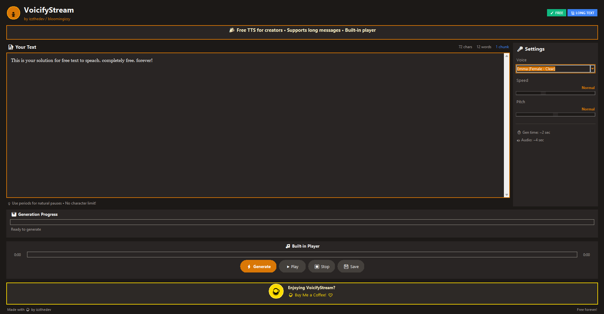

# VoicifyStream Desktop 🎙️
## Advanced Text-to-Speech App for Windows

A standalone desktop application for realistic text-to-speech generation using OpenAI's TTS API.



---

## Features

- ✅ **9 Realistic Voices**: Alloy, Ash, Coral, Echo, Fable, Nova, Onyx, Sage, Shimmer
- ✅ **Quality Options**: Standard (tts-1) or HD (tts-1-hd)
- ✅ **Speed Control**: 0.25x to 4.0x
- ✅ **Volume Control**: Built-in volume adjustment
- ✅ **Multiple Formats**: MP3, WAV, FLAC, AAC
- ✅ **Play/Pause/Stop**: Full playback controls
- ✅ **Save Audio**: Export to any location
- ✅ **Dark Theme**: Easy on the eyes for streamers
- ✅ **API Key Storage**: Saves your key securely

---

## Quick Start (Run from Source)

### 1. Install Python
Download Python 3.10+ from [python.org](https://www.python.org/downloads/)

> ⚠️ Check "Add Python to PATH" during installation!

### 2. Install Dependencies
Open Command Prompt and run:
```bash
cd path/to/voicify-desktop
pip install -r requirements.txt
```

### 3. Run the App
```bash
python voicify_stream.py
```

### 4. Get OpenAI API Key
1. Go to [platform.openai.com/api-keys](https://platform.openai.com/api-keys)
2. Create a new API key
3. Paste it into the app and click "Save Key"

---

## Build .exe File (Standalone App)

### Option 1: Simple Build
```bash
pip install pyinstaller
pyinstaller --onefile --windowed voicify_stream.py
```

The .exe will be in the `dist` folder.

### Option 2: With Custom Icon
1. Get a `.ico` file (you can convert PNG at [icoconvert.com](https://icoconvert.com/))
2. Name it `icon.ico` and place in the same folder
3. Run:
```bash
pyinstaller --onefile --windowed --icon=icon.ico --name="VoicifyStream" voicify_stream.py
```

### Option 3: Full Build with Spec File
Create `voicify.spec`:
```python
# -*- mode: python ; coding: utf-8 -*-
a = Analysis(
    ['voicify_stream.py'],
    pathex=[],
    binaries=[],
    datas=[],
    hiddenimports=['pygame', 'openai'],
    hookspath=[],
    hooksconfig={},
    runtime_hooks=[],
    excludes=[],
    noarchive=False,
)
pyz = PYZ(a.pure)
exe = EXE(
    pyz,
    a.scripts,
    a.binaries,
    a.datas,
    [],
    name='VoicifyStream',
    debug=False,
    bootloader_ignore_signals=False,
    strip=False,
    upx=True,
    console=False,
    icon='icon.ico',
)
```

Then run:
```bash
pyinstaller voicify.spec
```

---

## Folder Structure
```
voicify-desktop/
├── voicify_stream.py    # Main application
├── requirements.txt     # Python dependencies
├── README.md           # This file
├── icon.ico            # Optional app icon
└── dist/               # Built .exe location (after build)
    └── VoicifyStream.exe
```

---

## Troubleshooting

### "Python not found"
- Reinstall Python with "Add to PATH" checked
- Or use full path: `C:\Python310\python.exe voicify_stream.py`

### "No module named openai"
```bash
pip install openai pygame
```

### "API key invalid"
- Make sure your OpenAI account has credits
- Check the key at [platform.openai.com/api-keys](https://platform.openai.com/api-keys)

### .exe is too large (100MB+)
This is normal - it includes Python runtime. Use UPX for compression:
```bash
pip install pyinstaller[upx]
pyinstaller --onefile --windowed --upx-dir=/path/to/upx voicify_stream.py
```

### Windows Defender blocks .exe
This is common for PyInstaller apps. Either:
- Add exception in Windows Security
- Sign the .exe with a code signing certificate

---

## API Costs

OpenAI TTS pricing (as of 2024):
- **tts-1**: $0.015 per 1,000 characters
- **tts-1-hd**: $0.030 per 1,000 characters

Example: 1000 words ≈ 5000 characters ≈ $0.075 (standard) or $0.15 (HD)

---

## License

MIT License - Free for personal and commercial use.

---

## Credits

Built with ❤️ using:
- [OpenAI TTS API](https://platform.openai.com/docs/guides/text-to-speech)
- [Python](https://python.org)
- [Pygame](https://pygame.org)
- [Tkinter](https://docs.python.org/3/library/tkinter.html)

Originally created with [Emergent](https://emergent.sh)
